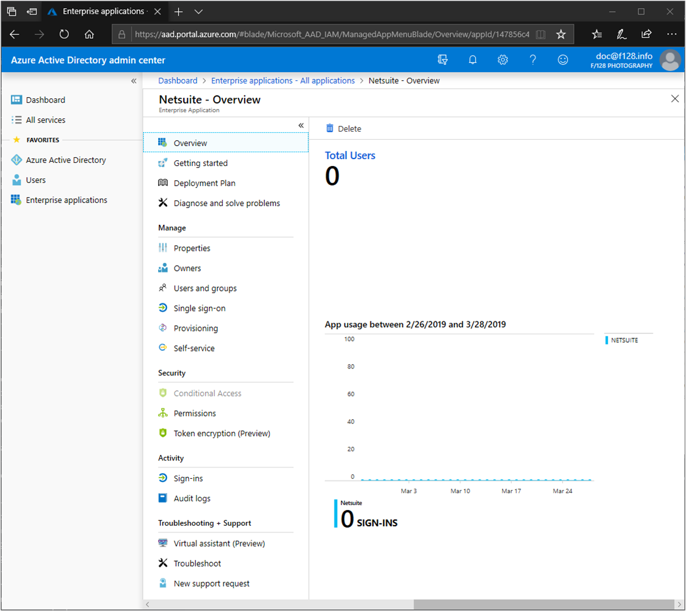
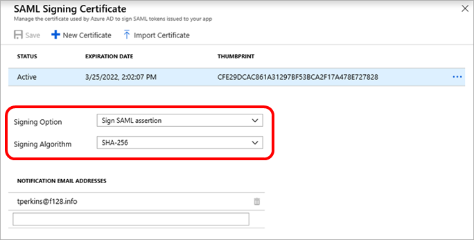

# Advanced certificate signing options in the SAML token for gallery apps in Azure Active Directory

Today Azure Active Directory (Azure AD) supports thousands of pre-integrated applications in the Azure Active Directory App Gallery. Over 500 of the applications support single sign-on by using the [Security Assertion Markup Language](https://wikipedia.org/wiki/Security_Assertion_Markup_Language) (SAML) 2.0 protocol, such as the [NetSuite](https://azuremarketplace.microsoft.com/marketplace/apps/aad.netsuite) application. When a customer authenticates to an application through Azure AD by using SAML, Azure AD sends a token to the application (via an HTTP POST). The application then validates and uses the token to sign in the customer instead of prompting for a username and password. These SAML tokens are signed with the unique certificate that's generated in Azure AD and by specific standard algorithms.

Azure AD uses some of the default settings for the gallery applications. The default values are set up based on the application's requirements.

In Azure AD, you can set up certificate signing options and the certificate signing algorithm.

## Certificate signing options

Azure AD supports three certificate signing options:

* **Sign SAML assertion**. This default option is set for most of the gallery applications. If you select this option, Azure AD as an Identity Provider (IdP) signs the SAML assertion and certificate with the [X.509](https://wikipedia.org/wiki/X.509) certificate of the application.

* **Sign SAML response**. If you select this option, Azure AD as an IdP signs the SAML response with the X.509 certificate of the application.

* **Sign SAML response and assertion**. If you select this option, Azure AD as an IdP signs the entire SAML token with the X.509 certificate of the application.

## Certificate signing algorithms

Azure AD supports two signing algorithms, or secure hash algorithms (SHAs), to sign the SAML response:

* **SHA-256**. Azure AD uses this default algorithm to sign the SAML response. It's the newest algorithm and is more secure than SHA-1. Most of the applications support the SHA-256 algorithm. If an application supports only SHA-1 as the signing algorithm, you can change it. Otherwise, we recommend that you use the SHA-256 algorithm for signing the SAML response.

* **SHA-1**. This algorithm is older, and it's treated as less secure than SHA-256. If an application supports only this signing algorithm, you can select this option in the **Signing Algorithm** drop-down list. Azure AD then signs the SAML response with the SHA-1 algorithm.

## Change the certificate signing options and certificate signing algorithm

To change an application's SAML certificate signing options and the certificate signing algorithm, select the application in question:

1. In the [Azure Active Directory portal](https://aad.portal.azure.com/), sign in to your account. The **Azure Active Directory admin center** page appears.
1. In the left pane, select **Enterprise applications**. A list of the enterprise applications in your account appears.
1. Select an application. An overview page for the application appears.

   

Next, change the certificate signing options in the SAML token for that application:

1. In the left pane of the application overview page, select **Single sign-on**.

2. If the **Set up Single Sign-On with SAML - Preview** page appears, go to step 5.

3. If the **Select a single sign-on method** page doesn't appear, select **Change single sign-on modes** to display that page.

4. In the **Select a single sign-on method** page, select **SAML** if available. (If **SAML** isn't available, the application doesn't support SAML, and you may ignore the rest of this procedure and article.)

5. In the **Set up Single Sign-On with SAML - Preview** page, find the **SAML Signing Certificate** heading and select the **Edit** icon (a pencil). The **SAML Signing Certificate** page appears.

   

6. In the **Signing Option** drop-down list, choose **Sign SAML response**, **Sign SAML assertion**, or **Sign SAML response and assertion**. Descriptions of these options appear earlier in this article in the [Certificate signing options](#certificate-signing-options).

7. In the **Signing Algorithm** drop-down list, choose **SHA-1** or **SHA-256**. Descriptions of these options appear earlier in this article in the [Certificate signing algorithms](#certificate-signing-algorithms) section.

8. If you're satisfied with your choices, select **Save** to apply the new SAML signing certificate settings. Otherwise, select the **X** to discard the changes.

## Next steps

* [Configure single sign-on to applications that are not in the Azure Active Directory App Gallery](configure-federated-single-sign-on-non-gallery-applications.md)
* [Troubleshoot SAML-based single sign-on](../develop/howto-v1-debug-saml-sso-issues.md)
