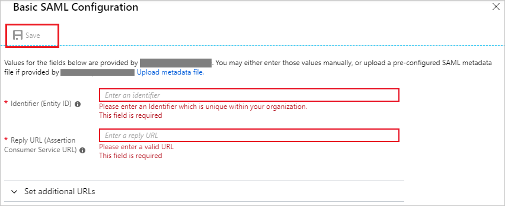
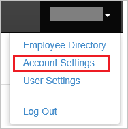
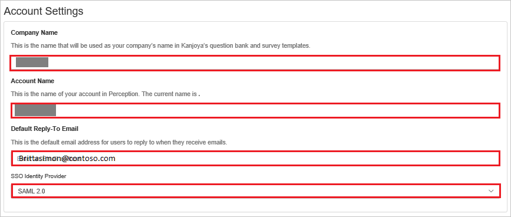

# Tutorial: Azure Active Directory integration with Perception United States (Non-UltiPro)

In this tutorial, you learn how to integrate Perception United States (Non-UltiPro) with Azure Active Directory (Azure AD).
Integrating Perception United States (Non-UltiPro) with Azure AD provides you with the following benefits:

* You can control in Azure AD who has access to Perception United States (Non-UltiPro).
* You can enable your users to be automatically signed-in to Perception United States (Non-UltiPro) (Single Sign-On) with their Azure AD accounts.
* You can manage your accounts in one central location - the Azure portal.

If you want to know more details about SaaS app integration with Azure AD, see [What is application access and single sign-on with Azure Active Directory](https://docs.microsoft.com/azure/active-directory/active-directory-appssoaccess-whatis).
If you don't have an Azure subscription, [create a free account](https://azure.microsoft.com/free/) before you begin.

## Prerequisites

To configure Azure AD integration with Perception United States (Non-UltiPro), you need the following items:

* An Azure AD subscription. If you don't have an Azure AD environment, you can get one-month trial [here](https://azure.microsoft.com/pricing/free-trial/)
* Perception United States (Non-UltiPro) single sign-on enabled subscription

## Scenario description

In this tutorial, you configure and test Azure AD single sign-on in a test environment.

* Perception United States (Non-UltiPro) supports **IDP** initiated SSO

## Adding Perception United States (Non-UltiPro) from the gallery

To configure the integration of Perception United States (Non-UltiPro) into Azure AD, you need to add Perception United States (Non-UltiPro) from the gallery to your list of managed SaaS apps.

**To add Perception United States (Non-UltiPro) from the gallery, perform the following steps:**

1. In the **[Azure portal](https://portal.azure.com)**, on the left navigation panel, click **Azure Active Directory** icon.

	

2. Navigate to **Enterprise Applications** and then select the **All Applications** option.

	

3. To add new application, click **New application** button on the top of dialog.

	

4. In the search box, type **Perception United States (Non-UltiPro)**, select **Perception United States (Non-UltiPro)** from result panel then click **Add** button to add the application.

	 

## Configure and test Azure AD single sign-on

In this section, you configure and test Azure AD single sign-on with Perception United States (Non-UltiPro) based on a test user called **Britta Simon**.
For single sign-on to work, a link relationship between an Azure AD user and the related user in Perception United States (Non-UltiPro) needs to be established.

To configure and test Azure AD single sign-on with Perception United States (Non-UltiPro), you need to complete the following building blocks:

1. **[Configure Azure AD Single Sign-On](#configure-azure-ad-single-sign-on)** - to enable your users to use this feature.
2. **[Configure Perception United States (Non-UltiPro) Single Sign-On](#configure-perception-united-states-non-ultipro-single-sign-on)** - to configure the Single Sign-On settings on application side.
3. **[Create an Azure AD test user](#create-an-azure-ad-test-user)** - to test Azure AD single sign-on with Britta Simon.
4. **[Assign the Azure AD test user](#assign-the-azure-ad-test-user)** - to enable Britta Simon to use Azure AD single sign-on.
5. **[Create Perception United States (Non-UltiPro) test user](#create-perception-united-states-non-ultipro-test-user)** - to have a counterpart of Britta Simon in Perception United States (Non-UltiPro) that is linked to the Azure AD representation of user.
6. **[Test single sign-on](#test-single-sign-on)** - to verify whether the configuration works.

### Configure Azure AD single sign-on

In this section, you enable Azure AD single sign-on in the Azure portal.

To configure Azure AD single sign-on with Perception United States (Non-UltiPro), perform the following steps:

1. In the [Azure portal](https://portal.azure.com/), on the **Perception United States (Non-UltiPro)** application integration page, select **Single sign-on**.

    

2. On the **Select a Single sign-on method** dialog, select **SAML/WS-Fed** mode to enable single sign-on.

    

3. On the **Set up Single Sign-On with SAML** page, click **Edit** icon to open **Basic SAML Configuration** dialog.

	

4. On the **Set up Single Sign-On with SAML** page, perform the following steps:

    

    a. In the **Identifier** text box, type a URL:
    `https://perception.kanjoya.com/sp`

    b. In the **Reply URL** text box, type a URL using the following pattern:
    `https://perception.kanjoya.com/sso?idp=<entity_id>`

	c. The **Perception United States (Non-UltiPro)** application requires the **Azure AD Identifier** value as <entity_id>, which you will get from the **Set up Perception United States (Non-UltiPro)** section, to be uri encoded. To get the uri encoded value, use the following link: **http://www.url-encode-decode.com/**.

	d. After getting the uri encoded value combine it with the **Reply URL** as mentioned below-

	`https://perception.kanjoya.com/sso?idp=<URI encooded entity_id>`
	
	e. Paste the above value in the **Reply URL** textbox.

5. On the **Set up Single Sign-On with SAML** page, in the **SAML Signing Certificate** section, click **Download** to download the **Federation Metadata XML** from the given options as per your requirement and save it on your computer.

	

6. On the **Set up Perception United States (Non-UltiPro)** section, copy the appropriate URL(s) as per your requirement.

	

	a. Login URL

	b. Azure AD Identifier

	c. Logout URL	

### Configure Perception United States (Non-UltiPro) Single Sign-On

1. In another browser window, sign on to your Perception United States (Non-UltiPro) company site as an administrator.

2. In the main toolbar, click **Account Settings**.

    

3. On the **Account Settings** page, perform the following steps:

	

	a. In the **Company Name** textbox, type the name of the **Company**.
	
	b. In the **Account Name** textbox, type the name of the **Account**.

	c. In **Default Reply-To Email** text box, type the valid **Email**.

	d. Select **SSO Identity Provider** as **SAML 2.0**.

4. On the **SSO Configuration** page, perform the following steps:

    

	a. Select **SAML NameID Type** as **EMAIL**.

	b. In the **SSO Configuration Name** textbox, type the name of your **Configuration**.
	
	c. In **Identity Provider Name** textbox, paste the value of **Azure AD Identifier**, which you have copied from Azure portal. 

	d. In **SAML Domain textbox**, enter the domain like @contoso.com.

	e. Click on **Upload Again** to upload the **Metadata XML** file.

	f. Click **Update**.

### Create an Azure AD test user 

The objective of this section is to create a test user in the Azure portal called Britta Simon.

1. In the Azure portal, in the left pane, select **Azure Active Directory**, select **Users**, and then select **All users**.

    

2. Select **New user** at the top of the screen.

    

3. In the User properties, perform the following steps.

    

    a. In the **Name** field enter **BrittaSimon**.
  
    b. In the **User name** field type brittasimon@yourcompanydomain.extension. For example, BrittaSimon@contoso.com

    c. Select **Show password** check box, and then write down the value that's displayed in the Password box.

    d. Click **Create**.

### Assign the Azure AD test user

In this section, you enable Britta Simon to use Azure single sign-on by granting access to Perception United States (Non-UltiPro).

1. In the Azure portal, select **Enterprise Applications**, select **All applications**, then select **Perception United States (Non-UltiPro)**.

	

2. In the applications list, select **Perception United States (Non-UltiPro)**.

	

3. In the menu on the left, select **Users and groups**.

    

4. Click the **Add user** button, then select **Users and groups** in the **Add Assignment** dialog.

    

5. In the **Users and groups** dialog select **Britta Simon** in the Users list, then click the **Select** button at the bottom of the screen.

6. If you are expecting any role value in the SAML assertion then in the **Select Role** dialog select the appropriate role for the user from the list, then click the **Select** button at the bottom of the screen.

7. In the **Add Assignment** dialog click the **Assign** button.

### Create Perception United States (Non-UltiPro) test user

In this section, you create a user called Britta Simon in Perception United States (Non-UltiPro). Work with [Perception United States (Non-UltiPro) support team](https://www.ultimatesoftware.com/Contact/ContactUs) to add the users in the Perception United States (Non-UltiPro) platform.

### Test single sign-on 

In this section, you test your Azure AD single sign-on configuration using the Access Panel.

When you click the Perception United States (Non-UltiPro) tile in the Access Panel, you should be automatically signed in to the Perception United States (Non-UltiPro) for which you set up SSO. For more information about the Access Panel, see [Introduction to the Access Panel](https://docs.microsoft.com/azure/active-directory/active-directory-saas-access-panel-introduction).

## Additional Resources

- [ List of Tutorials on How to Integrate SaaS Apps with Azure Active Directory ](https://docs.microsoft.com/azure/active-directory/active-directory-saas-tutorial-list)

- [What is application access and single sign-on with Azure Active Directory? ](https://docs.microsoft.com/azure/active-directory/active-directory-appssoaccess-whatis)

- [What is conditional access in Azure Active Directory?](https://docs.microsoft.com/azure/active-directory/conditional-access/overview)

