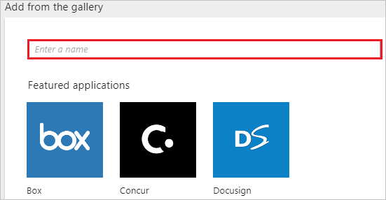
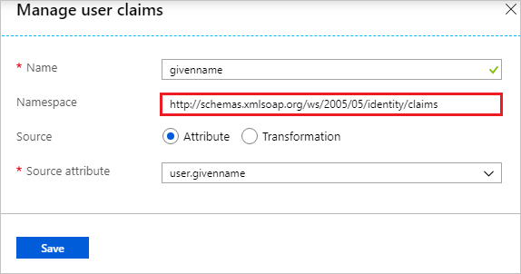
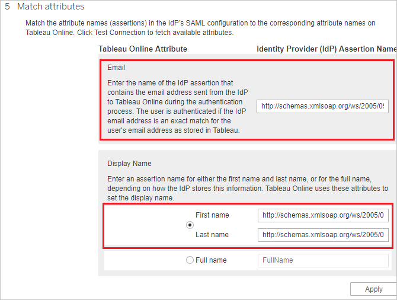
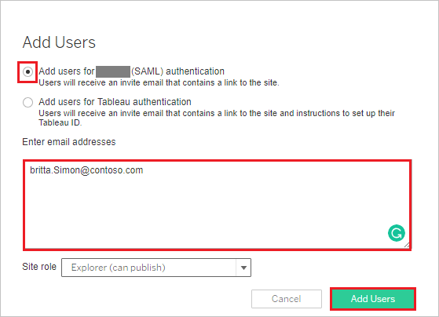

# Tutorial: Azure Active Directory integration with Tableau Online

In this tutorial, you learn how to integrate Tableau Online with Azure Active Directory (Azure AD).
Integrating Tableau Online with Azure AD provides you with the following benefits:

* You can control in Azure AD who has access to Tableau Online.
* You can enable your users to be automatically signed-in to Tableau Online (Single Sign-On) with their Azure AD accounts.
* You can manage your accounts in one central location - the Azure portal.

If you want to know more details about SaaS app integration with Azure AD, see [What is application access and single sign-on with Azure Active Directory](https://docs.microsoft.com/azure/active-directory/active-directory-appssoaccess-whatis).
If you don't have an Azure subscription, [create a free account](https://azure.microsoft.com/free/) before you begin.

## Prerequisites

To configure Azure AD integration with Tableau Online, you need the following items:

* An Azure AD subscription. If you don't have an Azure AD environment, you can get a [free account](https://azure.microsoft.com/free/)
* Tableau Online single sign-on enabled subscription

## Scenario description

In this tutorial, you configure and test Azure AD single sign-on in a test environment.

* Tableau Online supports **SP** initiated SSO

## Adding Tableau Online from the gallery

To configure the integration of Tableau Online into Azure AD, you need to add Tableau Online from the gallery to your list of managed SaaS apps.

**To add Tableau Online from the gallery, perform the following steps:**

1. In the **[Azure portal](https://portal.azure.com)**, on the left navigation panel, click **Azure Active Directory** icon.

	

2. Navigate to **Enterprise Applications** and then select the **All Applications** option.

	

3. To add new application, click **New application** button on the top of dialog.

	

4. In the search box, type **Tableau Online**, select **Tableau Online** from result panel then click **Add** button to add the application.

	 

## Configure and test Azure AD single sign-on

In this section, you configure and test Azure AD single sign-on with Tableau Online based on a test user called **Britta Simon**.
For single sign-on to work, a link relationship between an Azure AD user and the related user in Tableau Online needs to be established.

To configure and test Azure AD single sign-on with Tableau Online, you need to complete the following building blocks:

1. **[Configure Azure AD Single Sign-On](#configure-azure-ad-single-sign-on)** - to enable your users to use this feature.
2. **[Configure Tableau Online Single Sign-On](#configure-tableau-online-single-sign-on)** - to configure the Single Sign-On settings on application side.
3. **[Create an Azure AD test user](#create-an-azure-ad-test-user)** - to test Azure AD single sign-on with Britta Simon.
4. **[Assign the Azure AD test user](#assign-the-azure-ad-test-user)** - to enable Britta Simon to use Azure AD single sign-on.
5. **[Create Tableau Online test user](#create-tableau-online-test-user)** - to have a counterpart of Britta Simon in Tableau Online that is linked to the Azure AD representation of user.
6. **[Test single sign-on](#test-single-sign-on)** - to verify whether the configuration works.

### Configure Azure AD single sign-on

In this section, you enable Azure AD single sign-on in the Azure portal.

To configure Azure AD single sign-on with Tableau Online, perform the following steps:

1. In the [Azure portal](https://portal.azure.com/), on the **Tableau Online** application integration page, select **Single sign-on**.

    

2. On the **Select a Single sign-on method** dialog, select **SAML/WS-Fed** mode to enable single sign-on.

    

3. On the **Set up Single Sign-On with SAML** page, click **Edit** icon to open **Basic SAML Configuration** dialog.

	

4. On the **Basic SAML Configuration** section, perform the following steps:

    

	a. In the **Sign on URL** text box, type the URL:
    `https://sso.online.tableau.com/public/sp/login?alias=<entityid>`

    b. In the **Identifier (Entity ID)** text box, type the URL:
    `https://sso.online.tableau.com/public/sp/metadata?alias=<entityid>`

    > [!NOTE]
    > You will get the `<entityid>` value from the **Set up Tableau Online** section in this tutorial. The entity ID value will be **Azure AD identifier** value in **Set up Tableau Online** section.

5. On the **Set up Single Sign-On with SAML** page, in the **SAML Signing Certificate** section, click **Download** to download the **Federation Metadata XML** from the given options as per your requirement and save it on your computer.

	

6. On the **Set up Tableau Online** section, copy the appropriate URL(s) as per your requirement.

	

	a. Login URL

	b. Azure AD Identifier

	c. Logout URL

### Configure Tableau Online Single Sign-On

1. In a different browser window, sign-on to your Tableau Online application. Go to **Settings** and then **Authentication**.

    

2. To enable SAML, Under **Authentication types** section. Check **Enable an additional authentication method** and then check **SAML** checkbox.

    

3. Scroll down up to **Import metadata file into Tableau Online** section.  Click Browse and import the metadata file, which you have downloaded from Azure AD. Then, click **Apply**.

   

4. In the **Match assertions** section, insert the corresponding Identity Provider assertion name for **email address**, **first name**, and **last name**. To get this information from Azure AD: 
  
    a. In the Azure portal, go on the **Tableau Online** application integration page.

	b. In the **User Attributes & Claims**** section, click on the edit icon.

   

	c. Copy the namespace value for these attributes: givenname, email and surname by using the following steps:

   

    d. Click **user.givenname** value

    e. Copy the value from the **Namespace** textbox.

    

    f. To copy the namespace values for the email and surname repeat the above steps.

    g. Switch to the Tableau Online application, then set the **User Attributes & Claims** section as follows:

    * Email: **mail** or **userprincipalname**

    * First name: **givenname**

    * Last name: **surname**

    

### Create an Azure AD test user

The objective of this section is to create a test user in the Azure portal called Britta Simon.

1. In the Azure portal, in the left pane, select **Azure Active Directory**, select **Users**, and then select **All users**.

    

2. Select **New user** at the top of the screen.

    

3. In the User properties, perform the following steps.

    

    a. In the **Name** field enter **BrittaSimon**.
  
    b. In the **User name** field type **brittasimon@yourcompanydomain.extension**  
    For example, BrittaSimon@contoso.com

    c. Select **Show password** check box, and then write down the value that's displayed in the Password box.

    d. Click **Create**.

### Assign the Azure AD test user

In this section, you enable Britta Simon to use Azure single sign-on by granting access to Tableau Online.

1. In the Azure portal, select **Enterprise Applications**, select **All applications**, then select **Tableau Online**.

	

2. In the applications list, select **Tableau Online**.

	

3. In the menu on the left, select **Users and groups**.

    

4. Click the **Add user** button, then select **Users and groups** in the **Add Assignment** dialog.

    

5. In the **Users and groups** dialog select **Britta Simon** in the Users list, then click the **Select** button at the bottom of the screen.

6. If you are expecting any role value in the SAML assertion then in the **Select Role** dialog select the appropriate role for the user from the list, then click the **Select** button at the bottom of the screen.

7. In the **Add Assignment** dialog click the **Assign** button.

### Create Tableau Online test user

In this section, you create a user called Britta Simon in Tableau Online.

1. On **Tableau Online**, click **Settings** and then **Authentication** section. Scroll down to **Manage Users** section. Click **Add Users** and then click **Enter Email Addresses**.
  
    

2. Select **Add users for (SAML) authentication**. In the **Enter email addresses** textbox add britta.simon@contoso.com
  
    

3. Click **Add Users**.

### Test single sign-on

In this section, you test your Azure AD single sign-on configuration using the Access Panel.

When you click the Tableau Online tile in the Access Panel, you should be automatically signed in to the Tableau Online for which you set up SSO. For more information about the Access Panel, see [Introduction to the Access Panel](https://docs.microsoft.com/azure/active-directory/active-directory-saas-access-panel-introduction).

## Additional Resources

- [ List of Tutorials on How to Integrate SaaS Apps with Azure Active Directory ](https://docs.microsoft.com/azure/active-directory/active-directory-saas-tutorial-list)

- [What is application access and single sign-on with Azure Active Directory? ](https://docs.microsoft.com/azure/active-directory/active-directory-appssoaccess-whatis)

- [What is conditional access in Azure Active Directory?](https://docs.microsoft.com/azure/active-directory/conditional-access/overview)
