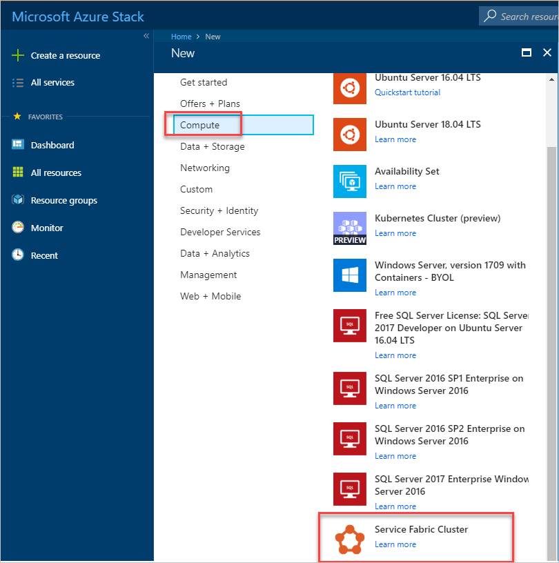
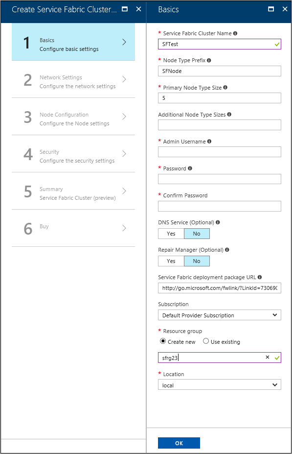
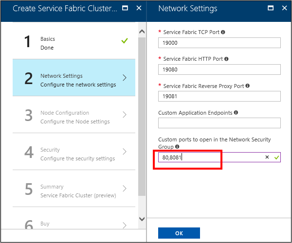
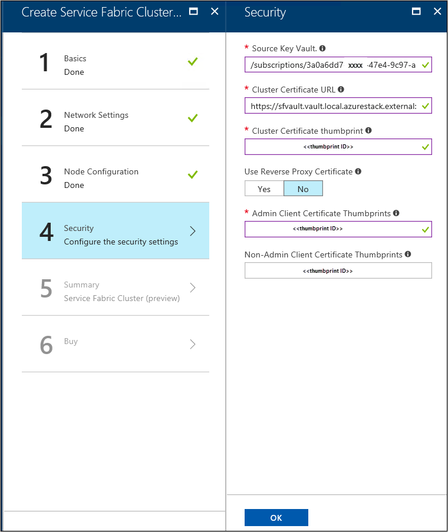
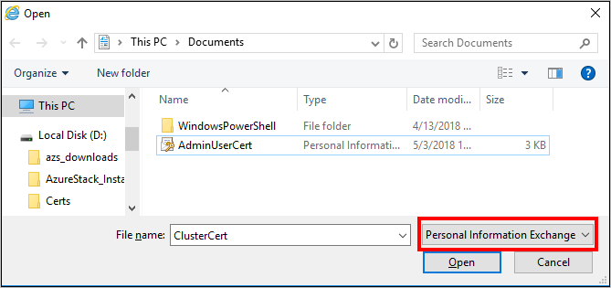
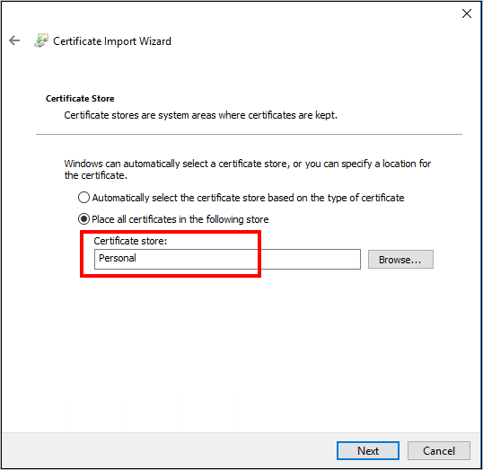
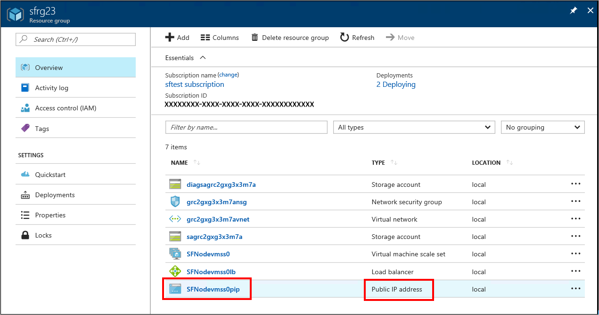
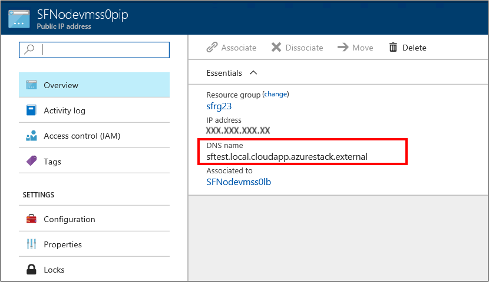
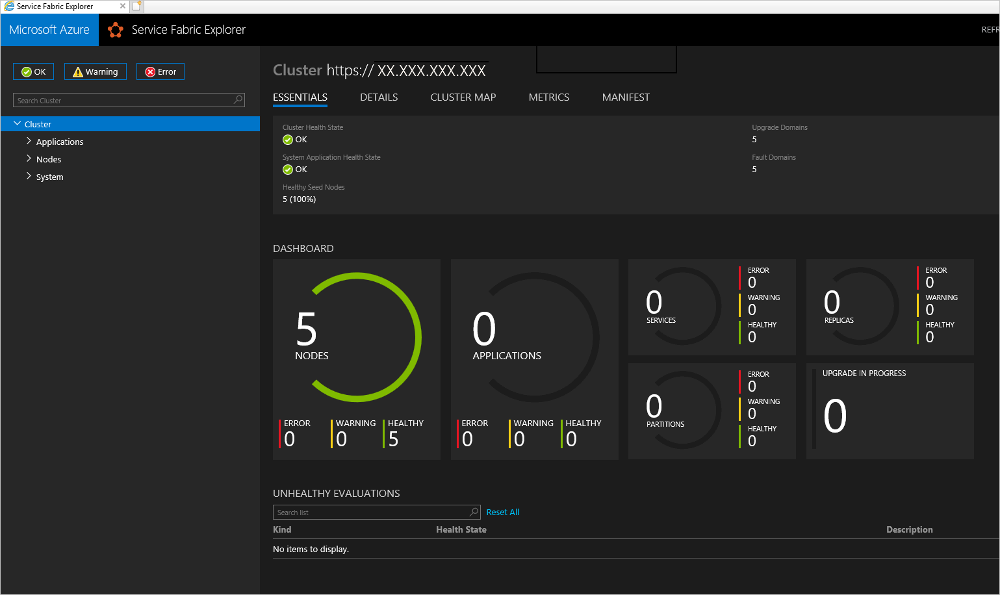
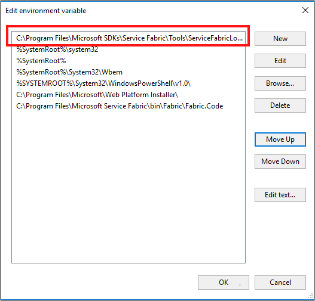

---
title: Deploy a secured Service Fabric cluster in Azure Stack | Microsoft Docs
description: Learn how to deploy a secured Service Fabric cluster in Azure Stack
services: azure-stack
documentationcenter: ''
author: mattbriggs
manager: femila
editor: ''

ms.service: azure-stack
ms.workload: na
ms.tgt_pltfrm: na
ms.devlang: na
ms.topic: tutorial
ms.date: 01/25/2019
ms.author: mabrigg
ms.reviewer: shnatara
ms.lastreviewed: 01/25/2019
---

# Deploy a Service Fabric cluster in Azure Stack

Use the **Service Fabric Cluster** item from the Azure Marketplace to deploy a secured Service Fabric cluster in Azure Stack. 

For more information about working with Service Fabric, see [Overview of Azure Service Fabric](https://docs.microsoft.com/azure/service-fabric/service-fabric-overview) and [Service Fabric cluster security scenarios](https://docs.microsoft.com/azure/service-fabric/service-fabric-cluster-security), in the Azure documentation.

The Service Fabric cluster in Azure Stack is not using the resource provider Microsoft.ServiceFabric. Rather, in Azure Stack, the Service Fabric cluster is a virtual machine scale set with preinstalled software set using Desired State Configuration (DSC).

## Prerequisites

The following are required to deploy the Service Fabric cluster:
1. **Cluster certificate**  
   This is the X.509 server certificate you add to KeyVault when deploying Service Fabric. 
   - The **CN** on this cert must match the Fully Qualified Domain Name (FQDN) of the Service Fabric cluster you create. 
   - The certificate format must be PFX, as both the public and private keys are required. 
     See [requirements](https://docs.microsoft.com/azure/service-fabric/service-fabric-cluster-security) for creating this server-side cert.

     > [!NOTE]  
     > You can use a self-signed certificate inplace of the x.509 server certificate for test purposes. Self-signed certificates do not need to match the FQDN of the cluster.

1. **Admin Client certificate** 
   This is the certificate that the client will use to authenticate to the Service Fabric cluster, which can be self-signed. See [requirements](https://docs.microsoft.com/azure/service-fabric/service-fabric-cluster-security) for creating this client cert.

1. **The following items must be available in the Azure Stack Marketplace:**
    - **Windows Server 2016** – The template uses the Windows Server 2016 image to create the cluster.  
    - **Customer Script Extension** - Virtual Machine Extension from Microsoft.  
    - **PowerShell Desired Stage Configuration** - Virtual Machine Extension from Microsoft.


## Add a secret to Key Vault
To deploy a Service Fabric cluster, you must specify the correct KeyVault *Secret Identifier* or URL for the Service Fabric cluster. The Azure Resource Manager template takes a KeyVault as input. Then the template retrieves the Cluster certificate when installing the Service Fabric cluster.

> [!IMPORTANT]  
> You must use PowerShell to add a secret to KeyVault for use with Service Fabric. Do not use the portal.  

Use the following script to create the KeyVault and add the *cluster certificate* to it. (See the [prerequisites](#prerequisites).) Before you run the script, review the sample script and update the indicated parameters to match your environment. This script will also output the values you need to provide to the Azure Resource Manager template. 

> [!TIP]  
> Before the script can succeed, there must be a public offer that includes the services for Compute, Network, Storage, and KeyVault. 

  ```powershell
    function Get-ThumbprintFromPfx($PfxFilePath, $Password) 
        {
            return New-Object System.Security.Cryptography.X509Certificates.X509Certificate2($PfxFilePath, $Password)
        }
    
    function Publish-SecretToKeyVault ($PfxFilePath, $Password, $KeyVaultName)
       {
            $keyVaultSecretName = "ClusterCertificate"
            $certContentInBytes = [io.file]::ReadAllBytes($PfxFilePath)
            $pfxAsBase64EncodedString = [System.Convert]::ToBase64String($certContentInBytes)
    
            $jsonObject = ConvertTo-Json -Depth 10 ([pscustomobject]@{
                data     = $pfxAsBase64EncodedString
                dataType = 'pfx'
                password = $Password
            })
    
            $jsonObjectBytes = [System.Text.Encoding]::UTF8.GetBytes($jsonObject)
            $jsonEncoded = [System.Convert]::ToBase64String($jsonObjectBytes)
            $secret = ConvertTo-SecureString -String $jsonEncoded -AsPlainText -Force
            $keyVaultSecret = Set-AzureKeyVaultSecret -VaultName $KeyVaultName -Name $keyVaultSecretName -SecretValue $secret
            
            $pfxCertObject = Get-ThumbprintFromPfx -PfxFilePath $PfxFilePath -Password $Password
    
            Write-Host "KeyVault id: " -ForegroundColor Green
            (Get-AzureRmKeyVault -VaultName $KeyVaultName).ResourceId
            
            Write-Host "Secret Id: " -ForegroundColor Green
            (Get-AzureKeyVaultSecret -VaultName $KeyVaultName -Name $keyVaultSecretName).id
    
            Write-Host "Cluster Certificate Thumbprint: " -ForegroundColor Green
            $pfxCertObject.Thumbprint
       }
    
    #========================== CHANGE THESE VALUES ===============================
    $armEndpoint = "https://management.local.azurestack.external"
    $tenantId = "your_tenant_ID"
    $location = "local"
    $clusterCertPfxPath = "Your_path_to_ClusterCert.pfx"
    $clusterCertPfxPassword = "Your_password_for_ClusterCert.pfx"
    #==============================================================================
    
    Add-AzureRmEnvironment -Name AzureStack -ARMEndpoint $armEndpoint
    Login-AzureRmAccount -Environment AzureStack -TenantId $tenantId
    
    $rgName = "sfvaultrg"
    Write-Host "Creating Resource Group..." -ForegroundColor Yellow
    New-AzureRmResourceGroup -Name $rgName -Location $location
    
    Write-Host "Creating Key Vault..." -ForegroundColor Yellow
    $Vault = New-AzureRmKeyVault -VaultName sfvault -ResourceGroupName $rgName -Location $location -EnabledForTemplateDeployment -EnabledForDeployment -EnabledForDiskEncryption
    
    Write-Host "Publishing certificate to Vault..." -ForegroundColor Yellow
    Publish-SecretToKeyVault -PfxFilePath $clusterCertPfxPath -Password $clusterCertPfxPassword -KeyVaultName $vault.VaultName
   ``` 


For more information, see [Manage KeyVault on Azure Stack with
PowerShell](https://docs.microsoft.com/azure/azure-stack/user/azure-stack-key-vault-manage-powershell).

## Deploy the Marketplace item

1. In the user portal, go to **+ Create a resource** > **Compute** > **Service Fabric Cluster**. 

   

1. For each page, like *Basics*, fill out the deployment form. Use defaults if you're not sure of a value. Select **OK** to advance to the next page:

   

1. On the *Network Settings* page, you can specify specific ports to open for your applications:

   

1. On the *Security* page, add the values that you got from [creating the Azure KeyVault](#add-a-secret-to-key-vault) and Uploading the Secret.

   For the *Admin Client Certificate Thumbprint*, enter the thumbprint of the *Admin Client certificate*. (See the [prerequisites](#prerequisites).)
   
   - Source Key Vault:  Specify entire *keyVault id* string from the script results. 
   - Cluster Certificate URL: Specify the entire URL from the *Secret Id* from the script results. 
   - Cluster Certificate thumbprint: Specify the *Cluster Certificate Thumbprint* from the script results.
   - Admin Client Certificate Thumbprints: Specify the *Admin Client Certificate Thumbprint* created in the prerequisites. 

   

   

1. Complete the wizard, and then select **Create** to deploy the Service Fabric Cluster.


## Access the Service Fabric Cluster
You can access the Service Fabric cluster by using either the Service Fabric Explorer or Service Fabric PowerShell.


### Use Service Fabric Explorer
1.  Validate that the Web browser has access to your Admin client certificate and can authenticate to your Service Fabric cluster.  

    a. Open Internet Explorer and go to **Internet Options** > **Content** > **Certificates**.
  
    b. On Certificates, select **Import** to start the *Certificate Import Wizard*, and then click **Next**. On the *File to Import* page click **Browse**, and select the **Admin Client certificate** you provided to the Azure Resource Manager template.
        
       > [!NOTE]  
       > This certificate is not the Cluster certificate that was previously added to KeyVault.  

    c. Ensure that you have “Personal Information Exchange” selected in the extension dropdown of the File Explorer window.  

         

    d. On the *Certificate Store* page, select **Personal**, and then complete the wizard.  
         
1. To find the FQDN of your Service Fabric cluster:  

    a. Go to the resource group that is associated with your Service Fabric cluster and locate the *Public IP address* resource. Select the object associated with the Public IP address to open the *Public IP address* blade.  

         

    b. On the Public IP address blade, the FQDN displays as *DNS name*.  

        

1. To find the URL for the Service Fabric Explorer, and the Client connection endpoint, review the results of the Template deployment.

1. In your browser, go to https://*FQDN*:19080. Replace *FQDN* with the FQDN of your Service Fabric cluster from step 2.   
   If you’ve used a self-signed certificate, you’ll get a warning that the connection is not secure. To proceed to the web site, select **More Information**, and then **Go on to the webpage**. 

1. To authenticate to the site, you must select a certificate to use. Select **More choices**, pick the appropriate certificate, and then click **OK** to connect to the Service Fabric Explorer. 

   


## Use Service Fabric PowerShell

1. Install the *Microsoft Azure Service Fabric SDK* from [Prepare your development environment on Windows](https://docs.microsoft.com/azure/service-fabric/service-fabric-get-started#install-the-sdk-and-tools) in the Azure Service Fabric documentation.  

1. After the installation is complete, configure the system Environment variables to ensure that the Service Fabric cmdlets are accessible from PowerShell.  
    
    a. Go to **Control Panel** > **System and Security** > **System**, and then select **Advanced system settings**.  
    
       

    b. On the **Advanced** tab of *System Properties*, select **Environment Variables**.  

    c. For *System variables*, edit **Path** and make sure that **C:\\Program Files\\Microsoft Service Fabric\\bin\\Fabric\\Fabric.Code** is at the top of the list of environment variables.  

      

1. After changing the order of the environment variables, restart PowerShell and then run the following PowerShell script to gain access to the Service Fabric cluster:

   ```powershell  
    Connect-ServiceFabricCluster -ConnectionEndpoint "\[Service Fabric
    CLUSTER FQDN\]:19000" \`

    -X509Credential -ServerCertThumbprint
    761A0D17B030723A37AA2E08225CD7EA8BE9F86A \`

    -FindType FindByThumbprint -FindValue
    0272251171BA32CEC7938A65B8A6A553AA2D3283 \`

    -StoreLocation CurrentUser -StoreName My -Verbose
   ```
   
   > [!NOTE]  
   > There is no *https://* before the name of the cluster in the script. Port 19000 is required.

## Next steps

[Deploy Kubernetes to Azure Stack](azure-stack-solution-template-kubernetes-deploy.md)
