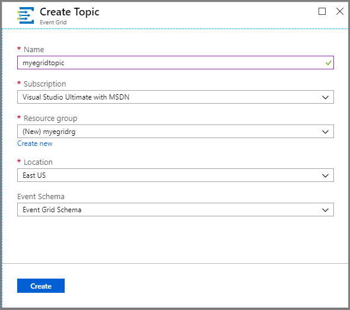
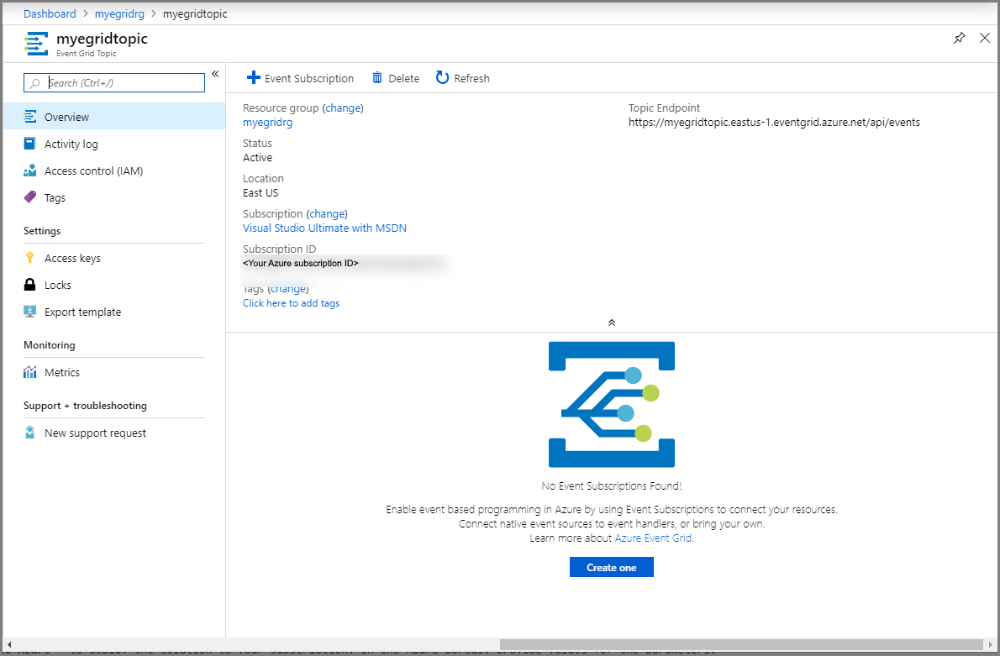
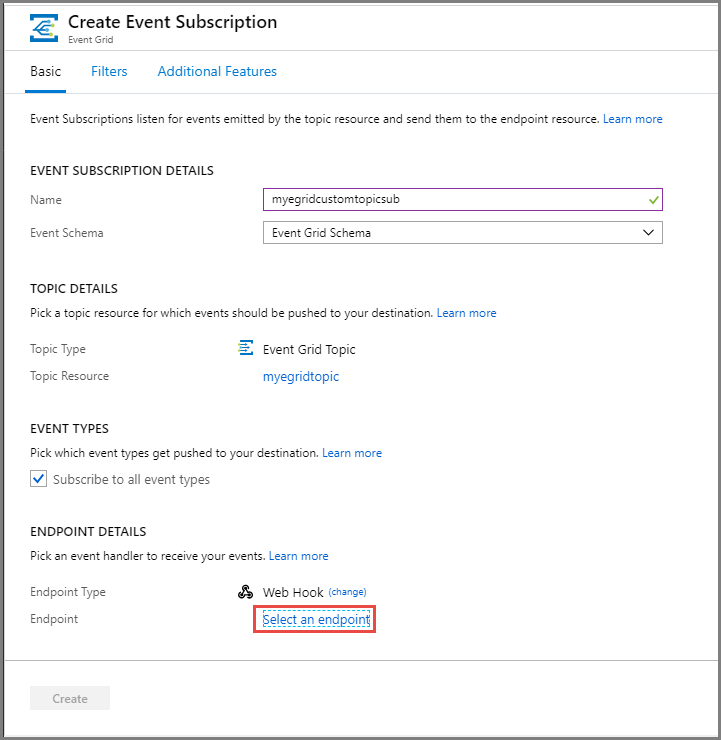
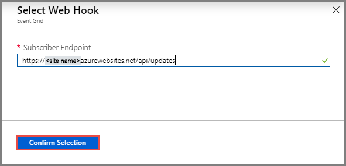
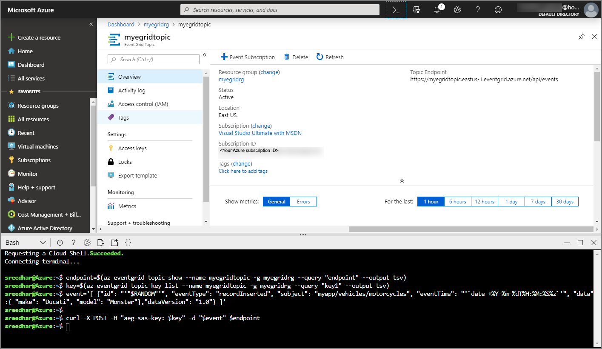

# Quickstart: Route custom events to web endpoint with the Azure portal and Event Grid

Azure Event Grid is an eventing service for the cloud. In this article, you use the Azure portal to create a custom topic, subscribe to the custom topic, and trigger the event to view the result. Typically, you send events to an endpoint that processes the event data and takes actions. However, to simplify this article, you send the events to a web app that collects and displays the messages.

When you're finished, you see that the event data has been sent to the web app.


[!INCLUDE [updated-for-az](../../includes/updated-for-az.md)]

[!INCLUDE [quickstarts-free-trial-note.md](../../includes/quickstarts-free-trial-note.md)]

[!INCLUDE [event-grid-register-provider-portal.md](../../includes/event-grid-register-provider-portal.md)]

## Create a custom topic

An event grid topic provides a user-defined endpoint that you post your events to. 

1. Sign in to [Azure portal](https://portal.azure.com/).
2. Select **All services** on the left navigational menu, search for **Event Grid**, and select **Event Grid Topics**. 

    
3. On the **Event Grid Topics** page, select **+ Add** on the toolbar. 

    
4. On the **Create Topic** page, follow these steps:
    1. Provide a unique **name** for the custom topic. The topic name must be unique because it's represented by a DNS entry. Don't use the name shown in the image. Instead, create your own name - it must be between 3-50 characters and contain only values a-z, A-Z, 0-9, and "-".
    2. Select your Azure **subscription**.
    3. Select an existing resource group or select **Create new**, and enter a **name** for the **resource group**.
    4. Select a **location** for the event grid topic.
    5. Keep the default value **Event Grid Schema** for the **Event Schema** field. 

       
    6. Select **Create**. 
5. After the custom topic has been created, you see the successful notification. Select **Go to resource group**. 

   
6. On the **Resource Group** page, select the event grid topic. 

   
7. You see the **Event Grid Topic** page for your event grid. Keep this page open. You use it later in the quickstart. 

    

## Create a message endpoint
Before you create a subscription for the custom topic, create an endpoint for the event message. Typically, the endpoint takes actions based on the event data. To simplify this quickstart, you deploy a [pre-built web app](https://github.com/Azure-Samples/azure-event-grid-viewer) that displays the event messages. The deployed solution includes an App Service plan, an App Service web app, and source code from GitHub.

1. In the article page, select **Deploy to Azure** to deploy the solution to your subscription. In the Azure portal, provide values for the parameters.

   <a href="https://portal.azure.com/#create/Microsoft.Template/uri/https%3A%2F%2Fraw.githubusercontent.com%2FAzure-Samples%2Fazure-event-grid-viewer%2Fmaster%2Fazuredeploy.json" target="_blank"></a>
1. The deployment may take a few minutes to complete. After the deployment has succeeded, view your web app to make sure it's running. In a web browser, navigate to: 
`https://<your-site-name>.azurewebsites.net`
1. You see the site but no events have been posted to it yet.

   

## Subscribe to custom topic

You subscribe to an event grid topic to tell Event Grid which events you want to track, and where to send the events.

1. Now, on the **Event Grid Topic** page for your custom topic, select **+ Event Subscription** on the toolbar.

   
2. On the **Create Event Subscription** page, follow these steps:
    1. Event a **name** for the event subscription.
    3. Select **Web Hook** for the **Endpoint type**. 
    4. Choose **Select an endpoint**. 

       
    5. For the web hook endpoint, provide the URL of your web app and add `api/updates` to the home page URL. Select **Confirm Selection**.

       
    6. Back on the **Create Event Subscription** page, select **Create**.

3. View your web app again, and notice that a subscription validation event has been sent to it. Select the eye icon to expand the event data. Event Grid sends the validation event so the endpoint can verify that it wants to receive event data. The web app includes code to validate the subscription.

    

## Send an event to your topic

Now, let's trigger an event to see how Event Grid distributes the message to your endpoint. Use either Azure CLI or PowerShell to send a test event to your custom topic. Typically, an application or Azure service would send the event data.

The first example uses Azure CLI. It gets the URL and key for the custom topic, and sample event data. Use your custom topic name for `<topic name>`. It creates sample event data. The `data` element of the JSON is the payload of your event. Any well-formed JSON can go in this field. You can also use the subject field for advanced routing and filtering. CURL is a utility that sends HTTP requests.


### Azure CLI
1. In the Azure portal, select **Cloud Shell**. Select **Bash** in the top-left corner of the Cloud Shell window. 

    
1. Run the following command to get the **endpoint** for the topic: After you copy and paste the command, update the **topic name** and **resource group name** before you run the command. 

    ```azurecli
    endpoint=$(az eventgrid topic show --name <topic name> -g <resource group name> --query "endpoint" --output tsv)
    ```
2. Run the following command to get the **key** for the custom topic: After you copy and paste the command, update the **topic name** and **resource group** name before you run the command. 

    ```azurecli
    key=$(az eventgrid topic key list --name <topic name> -g <resource group name> --query "key1" --output tsv)
    ```
3. Copy the following statement with the event definition, and press **ENTER**. 

    ```json
    event='[ {"id": "'"$RANDOM"'", "eventType": "recordInserted", "subject": "myapp/vehicles/motorcycles", "eventTime": "'`date +%Y-%m-%dT%H:%M:%S%z`'", "data":{ "make": "Ducati", "model": "Monster"},"dataVersion": "1.0"} ]'
    ```
4. Run the following **Curl** command to post the event:

    ```
    curl -X POST -H "aeg-sas-key: $key" -d "$event" $endpoint
    ```

### Azure PowerShell
The second example uses PowerShell to perform similar steps.

1. In the Azure portal, select **Cloud Shell**. Select **PowerShell** in the top-left corner of the Cloud Shell window. See the sample **Cloud Shell** window image in the Azure CLI section. 
2. Run the following command to get the **endpoint** for the topic: After you copy and paste the command, update the **topic name** and **resource group name** before you run the command. 

    ```powershell
    $endpoint = (Get-AzEventGridTopic -ResourceGroupName <resource group name> -Name <topic name>).Endpoint
    ```
3. Run the following command to get the **key** for the custom topic: After you copy and paste the command, update the **topic name** and **resource group** name before you run the command.

    ```powershell
    $keys = Get-AzEventGridTopicKey -ResourceGroupName gridResourceGroup -Name <topic name>
    ```
4. Prepare the event. Copy and run the statements in the Cloud Shell window. 

    ```azurepowershell
    $eventID = Get-Random 99999

    #Date format should be SortableDateTimePattern (ISO 8601)
    $eventDate = Get-Date -Format s

    #Construct body using Hashtable
    $htbody = @{
        id= $eventID
        eventType="recordInserted"
        subject="myapp/vehicles/motorcycles"
        eventTime= $eventDate   
        data= @{
            make="Ducati"
            model="Monster"
        }
        dataVersion="1.0"
    }
    
    #Use ConvertTo-Json to convert event body from Hashtable to JSON Object
    #Append square brackets to the converted JSON payload since they are expected in the event's JSON payload syntax
    $body = "["+(ConvertTo-Json $htbody)+"]"
    ```
5. Use the **Invoke-WebRequest** cmdlet to send the event. 

    ```powershell
    Invoke-WebRequest -Uri $endpoint -Method POST -Body $body -Headers @{"aeg-sas-key" = $keys.Key1}
    ```

### Verify in the Event Grid Viewer
You've triggered the event, and Event Grid sent the message to the endpoint you configured when subscribing. View your web app to see the event you just sent.

```json
{
  "id": "974",
  "eventType": "recordInserted",
  "subject": "myapp/vehicles/motorcycles",
  "eventTime": "2019-03-28T01:11:59+00:00",
  "data": {
    "make": "Ducati",
    "model": "Monster"
  },
  "dataVersion": "1.0",
  "metadataVersion": "1",
  "topic": "/subscriptions/11111111-1111-1111-1111-111111111111/resourceGroups/myegridrg/providers/Microsoft.EventGrid/topics/myegridtopic"
}
```

## Clean up resources
If you plan to continue working with this event, don't clean up the resources created in this article. Otherwise, delete the resources you created in this article.

1. Select **Resource Groups** on the left menu. If you don't see it on the left menu, select **All Services** on the left menu, and select **Resource Groups**. 
2. Select the resource group to launch the **Resource Group** page. 
3. Select **Delete resource group** on the toolbar. 
4. Confirm deletion by entering the name of the resource group, and select **Delete**. 

    

    The other resource group you see in the image was created and used by the Cloud Shell window. Delete it if you don't plan to use the Cloud Shell window later. 

## Next steps

Now that you know how to create custom topics and event subscriptions, learn more about what Event Grid can help you do:

- [About Event Grid](overview.md)
- [Route Blob storage events to a custom web endpoint](../storage/blobs/storage-blob-event-quickstart.md?toc=%2fazure%2fevent-grid%2ftoc.json)
- [Monitor virtual machine changes with Azure Event Grid and Logic Apps](monitor-virtual-machine-changes-event-grid-logic-app.md)
- [Stream big data into a data warehouse](event-grid-event-hubs-integration.md)
