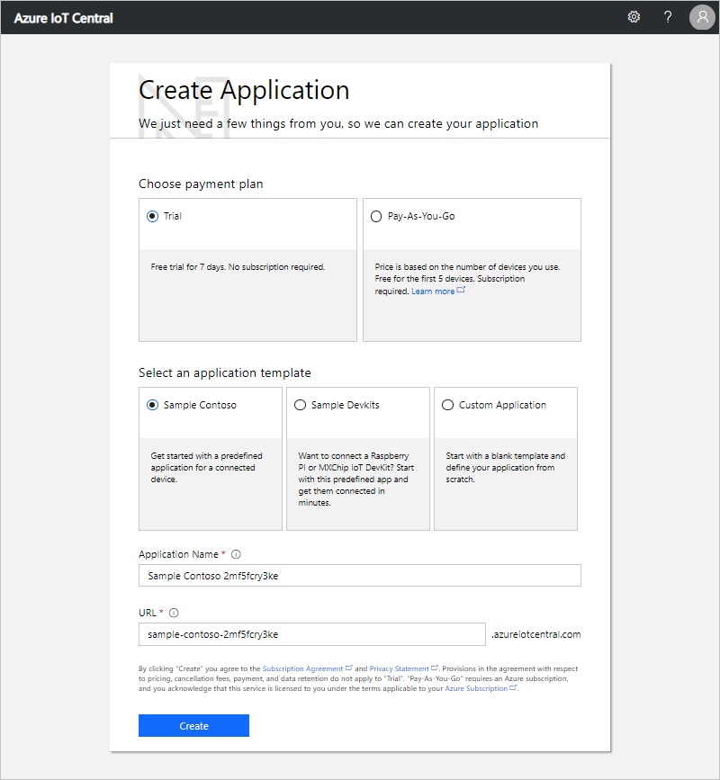

# Create an Azure IoT Central application

As a _builder_, you use the Azure IoT Central UI to define your Microsoft Azure IoT Central application. This quickstart shows you how to create an Azure IoT Central application that contains a sample _device template_ and simulated _devices_.

## Create the application

To complete this quickstart, you need to create an Azure IoT Central application from the **Sample Contoso** application template.

Navigate to the Azure IoT Central [Application Manager](https://aka.ms/iotcentral) page. Then enter the email address and password you use to access your Azure subscription:

To start creating a new Azure IoT Central application, choose **New Application**:

To create a new Azure IoT Central application:

1. Choose the **Free Trial Application** payment plan.
1. Choose a friendly application name, such as **Contoso IoT**. Azure IoT Central generates a unique URL prefix for you. You can change this URL prefix to something more memorable.
1. Choose the **Sample Contoso** application template.
1. Then choose **Create**.

## Next steps

In this quickstart, you created a pre-populated Azure IoT Central application that contains a **Refrigerated Vending Machine** device template and simulated devices. See [Define a new device template in your application](tutorial-define-device-type.md) to learn more, as a builder, about how to define your own device templates.
