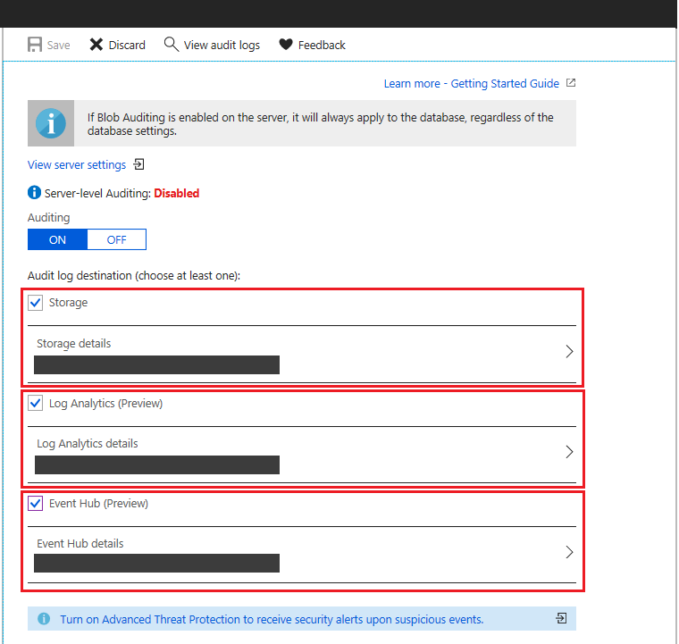
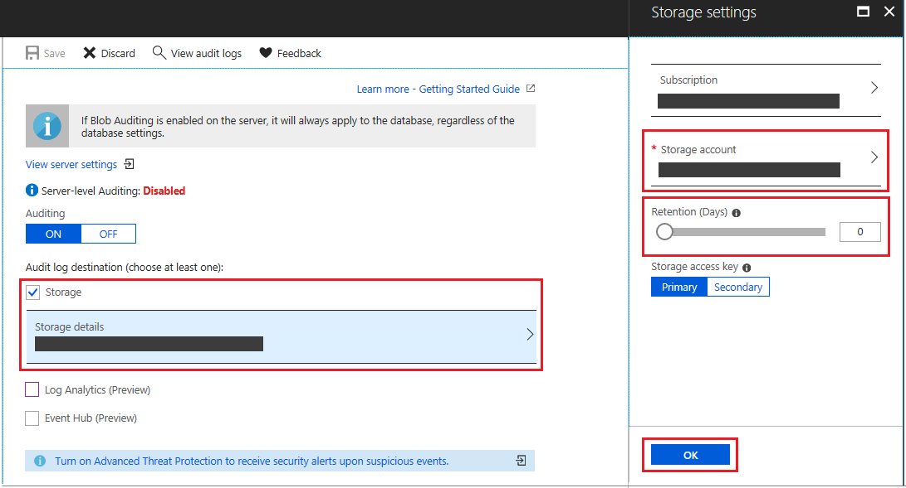
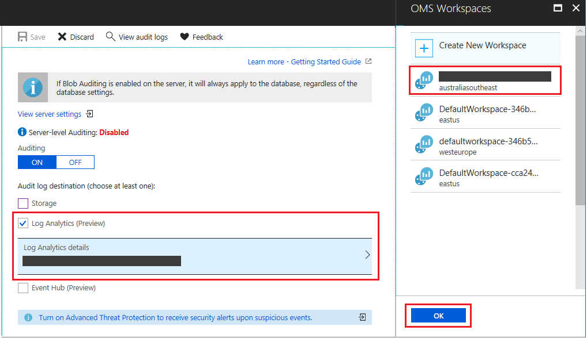
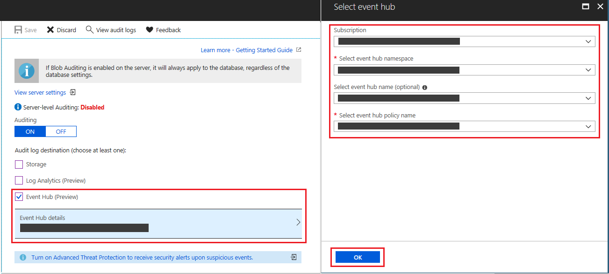
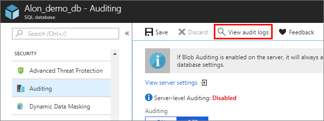
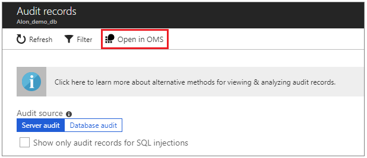

# Get started with SQL database auditing

Auditing for Azure [SQL Database](sql-database-technical-overview.md)  and [SQL Data Warehouse](../sql-data-warehouse/sql-data-warehouse-overview-what-is.md) tracks database events and writes them to an audit log in your Azure storage account, OMS workspace or Event Hubs. Auditing also:

- Helps you maintain regulatory compliance, understand database activity, and gain insight into discrepancies and anomalies that could indicate business concerns or suspected security violations.

- Enables and facilitates adherence to compliance standards, although it doesn't guarantee compliance. For more information about Azure programs that support standards compliance, see the [Azure Trust Center](https://azure.microsoft.com/support/trust-center/compliance/).

> [!NOTE] 
> This topic applies to Azure SQL server, and to both SQL Database and SQL Data Warehouse databases that are created on the Azure SQL server. For simplicity, SQL Database is used when referring to both SQL Database and SQL Data Warehouse.

[!INCLUDE [azure-monitor-log-analytics-rebrand](../../includes/azure-monitor-log-analytics-rebrand.md)]

## Azure SQL database auditing overview

You can use SQL database auditing to:

- **Retain** an audit trail of selected events. You can define categories of database actions to be audited.
- **Report** on database activity. You can use pre-configured reports and a dashboard to get started quickly with activity and event reporting.
- **Analyze** reports. You can find suspicious events, unusual activity, and trends.

> [!IMPORTANT]
> Audit logs are written to **Append Blobs** in Azure Blob storage on your Azure subscription.
>
> - All storage kinds (v1, v2, blob) are supported.
> - All storage replication configurations are supported.
> - **Premium storage** is currently **not supported**.
> - **Storage in VNet** is currently **not supported**.
> - **Storage behind a Firewall** is currently **not supported**

## Define server-level vs. database-level auditing policy

An auditing policy can be defined for a specific database or as a default server policy:

- A server policy applies to all existing and newly created databases on the server.

- If *server blob auditing is enabled*, it *always applies to the database*. The database will be audited, regardless of the database auditing settings.

- Enabling blob auditing on the database or data warehouse, in addition to enabling it on the server, does *not* override or change any of the settings of the server blob auditing. Both audits will exist side by side. In other words, the database is audited twice in parallel; once by the server policy and once by the database policy.

   > [!NOTE]
   > You should avoid enabling both server blob auditing and database blob auditing together, unless:
    > - You want to use a different *storage account* or *retention period* for a specific database.
    > - You want to audit event types or categories for a specific database that differ from the rest of the databases on the server. For example, you might have table inserts that need to be audited only for a specific database.
   >
   > Otherwise, we recommended that you enable only server-level blob auditing and leave the database-level auditing disabled for all databases.

## Set up auditing for your database

The following section describes the configuration of auditing using the Azure portal.

1. Go to the [Azure portal](https://portal.azure.com).
2. Navigate to **Auditing** under the Security heading in your SQL database/server pane.

    
    ![Navigation pane][1]

3. If you prefer to set up a server auditing policy, you can select the **View server settings** link on the database auditing page. You can then view or modify the server auditing settings. Server auditing policies  apply to all existing and newly created databases on this server.

    ![Navigation pane][2]

4. If you prefer to enable auditing on the database level, switch **Auditing** to **ON**.

    If server auditing is enabled, the database-configured audit will exist side-by-side with the server audit.

    ![Navigation pane][3]

5. **New** - You now have multiple options for configuring where audit logs will be written. You can write logs to an Azure storage account, to a Log Analytics workspace for consumption by Azure Monitor logs, or to event hub for consumption using event hub. You can configure any combination of these options, and audit logs will be written to each.

    

6. To configure writing audit logs to a storage account, select **Storage** and open **Storage details**. Select the Azure storage account where logs will be saved, and then select the retention period. The old logs will be deleted. Then click **OK**.

    

7. To configure writing audit logs to a Log Analytics workspace, select **Log Analytics (Preview)** and open **Log Analytics details**. Select or create the Log Analytics workspace where logs will be written and then click **OK**.

    

8. To configure writing audit logs to an event hub, select **Event Hub (Preview)** and open **Event Hub details**. Select the event hub where logs will be written and then click **OK**. Be sure that the event hub is in the same region as your database and server.

    

9. Click **Save**.
10. If you want to customize the audited events, you can do this via [PowerShell cmdlets](#subheading-7) or the [REST API](#subheading-9).
11. After you've configured your auditing settings, you can turn on the new threat detection feature and configure emails to receive security alerts. When you use threat detection, you receive proactive alerts on anomalous database activities that can indicate potential security threats. For more information, see [Getting started with threat detection](sql-database-threat-detection-get-started.md).

> [!IMPORTANT]
>Enabling auditing on an Azure SQL Data Warehouse, or on a server that has an Azure SQL Data Warehouse on it, **will result in the Data Warehouse being resumed**, even in the case where it was previously paused. **Please make sure to pause the Data Warehouse again after enabling auditing**.'

## Analyze audit logs and reports

If you chose to write audit logs to Azure Monitor logs:

- Use the [Azure portal](https://portal.azure.com).  Open the relevant database. At the top of the database's **Auditing** page, click **View audit logs**.

    

- Then, clicking on **Open in OMS** at the top of the **Audit records** page will open the Logs view in Log Analytics, where you can customize the time range and the search query.

    

- Alternatively, you can also access the audit logs from Log Analytics blade. Open your Log Analytics workspace and under **General** section, click **Logs**. You can start with a simple query, such as: *search "SQLSecurityAuditEvents"* to view the audit logs.
    From here, you can also use [Azure Monitor logs](../log-analytics/log-analytics-log-search.md)  to run advanced searches on your audit log data. Azure Monitor logs gives you real-time operational insights using integrated search and custom dashboards to readily analyze millions of records across all your workloads and servers. For additional useful information about Azure Monitor logs search language and commands, see [Azure Monitor logs search reference](../log-analytics/log-analytics-log-search.md).

If you chose to write audit logs to Event Hub:

- To consume audit logs data from Event Hub, you will need to set up a stream to consume events and write them to a target. For more information, see [Azure Event Hubs Documentation](https://docs.microsoft.com/azure/event-hubs/).
- Audit logs in Event Hub are captured in the body of [Apache Avro](https://avro.apache.org/) events and stored using JSON formatting with UTF-8 encoding. To read the audit logs, you can use [Avro Tools](https://docs.microsoft.com/azure/event-hubs/event-hubs-capture-overview#use-avro-tools) or similar tools that process this format.

If you chose to write audit logs to an Azure storage account, there are several methods you can use to view the logs:

- Audit logs are aggregated in the account you chose during setup. You can explore audit logs by using a tool such as [Azure Storage Explorer](https://storageexplorer.com/). In Azure storage, auditing logs are saved as a collection of blob files within a container named **sqldbauditlogs**. For further details about the hierarchy of the storage folder, naming conventions, and log format, see the [Blob Audit Log Format Reference](https://go.microsoft.com/fwlink/?linkid=829599).

- Use the [Azure portal](https://portal.azure.com).  Open the relevant database. At the top of the database's **Auditing** page, click **View audit logs**.

    ![Navigation pane][7]

    **Audit records** opens, from which you'll be able to view the logs.

  - You can view specific dates by clicking **Filter** at the top of the **Audit records** page.
  - You can switch between audit records that were created by the *server audit policy* and the *database audit policy* by toggling **Audit Source**.
  - You can view only SQL injection related audit records by checking  **Show only audit records for SQL injections** checkbox.

       ![Navigation pane][8]

- Use the system function **sys.fn_get_audit_file** (T-SQL) to return the audit log data in tabular format. For more information on using this function, see [sys.fn_get_audit_file](https://docs.microsoft.com/sql/relational-databases/system-functions/sys-fn-get-audit-file-transact-sql).

- Use **Merge Audit Files** in SQL Server Management Studio (starting with SSMS 17):
    1. From the SSMS menu, select **File** > **Open** > **Merge Audit Files**.

        ![Navigation pane][9]
    2. The **Add Audit Files** dialog box opens. Select one of the **Add** options to choose whether to merge audit files from a local disk or import them from Azure Storage. You are required to provide your Azure Storage details and account key.

    3. After all files to merge have been added, click **OK** to complete the merge operation.

    4. The merged file opens in SSMS, where you can view and analyze it, as well as export it to an XEL or CSV file, or to a table.

- Use Power BI. You can view and analyze audit log data in Power BI. For more information and to access a downloadable template, see [Analyze audit log data in Power BI](https://blogs.msdn.microsoft.com/azuresqldbsupport/20../../sql-azure-blob-auditing-basic-power-bi-dashboard/).
- Download log files from your Azure Storage blob container via the portal or by using a tool such as [Azure Storage Explorer](https://storageexplorer.com/).
  - After you have downloaded a log file locally, double-click the file to open, view, and analyze the logs in SSMS.
  - You can also download multiple files simultaneously via Azure Storage Explorer. To do so, right-click a specific subfolder and select **Save as** to save in a local folder.

- Additional methods:

  - After downloading several files or a subfolder that contains log files, you can merge them locally as described in the SSMS Merge Audit Files instructions described previously.
  - View blob auditing logs programmatically:

    - [Query Extended Events Files](https://sqlscope.wordpress.com/20../../reading-extended-event-files-using-client-side-tools-only/) by using PowerShell.

## Production practices

<!--The description in this section refers to preceding screen captures.-->

### <a id="subheading-6">Auditing geo-replicated databases</a>

With geo-replicated databases, when you enable auditing on the primary database the secondary database will have an identical auditing policy. It is also possible to set up auditing on the secondary database by enabling auditing on the **secondary server**, independently from the primary database.

- Server-level (**recommended**): Turn on auditing on both the **primary server** as well as the **secondary server** - the primary and secondary databases will each be audited independently based on their respective server-level policy.
- Database-level: Database-level auditing for secondary databases can only be configured from Primary database auditing settings.
  - Auditing must be enabled on the *primary database itself*, not the server.
  - After auditing is enabled on the primary database, it will also become enabled on the secondary database.

    >[!IMPORTANT]
    >With database-level auditing, the storage settings for the secondary database will be identical to those of the primary database, causing cross-regional traffic. We recommend that you enable only server-level auditing, and leave the database-level auditing disabled for all databases.
    > [!WARNING]
    > Using event hub or Azure Monitor logs as targets for audit logs at the server level is currently not supported for secondary geo-replicated databases.

### <a id="subheading-6">Storage key regeneration</a>

In production, you are likely to refresh your storage keys periodically. When writing audit logs to Azure storage, you need to resave your auditing policy when refreshing your keys. The process is as follows:

1. Open **Storage Details**. In the **Storage Access Key** box, select **Secondary**, and click **OK**. Then click **Save** at the top of the auditing configuration page.

    ![Navigation pane][5]
2. Go to the storage configuration page and regenerate the primary access key.

    ![Navigation pane][6]
3. Go back to the auditing configuration page, switch the storage access key from secondary to primary, and then click **OK**. Then click **Save** at the top of the auditing configuration page.
4. Go back to the storage configuration page and regenerate the secondary access key (in preparation for the next key's refresh cycle).

## Additional Information

- For details about the log format, hierarchy of the storage folder and naming conventions, see the [Blob Audit Log Format Reference](https://go.microsoft.com/fwlink/?linkid=829599).

    > [!IMPORTANT]
    > Azure SQL Database Audit stores 4000 characters of data for character fields in an audit record. When the **statement** or the **data_sensitivity_information** values returned from an auditable action contain more than 4000 characters, any data beyond the first 4000 characters will be **truncated and not audited**.

- Audit logs are written to **Append Blobs** in an Azure Blob storage on your Azure subscription:
  - **Premium Storage** is currently **not supported** by Append Blobs.
  - **Storage in VNet** is currently **not supported**.

- The default auditing policy includes all actions and the following set of action groups, which will audit all the queries and stored procedures executed against the database, as well as successful and failed logins:

    BATCH_COMPLETED_GROUP 
    SUCCESSFUL_DATABASE_AUTHENTICATION_GROUP 
    FAILED_DATABASE_AUTHENTICATION_GROUP

    You can configure auditing for different types of actions and action groups using PowerShell, as described in the [Manage SQL database auditing using Azure PowerShell](#subheading-7) section.

- When using AAD Authentication, failed logins records will *not* appear in the SQL audit log. To view failed login audit records, you need to visit the [Azure Active Directory portal]( ../active-directory/reports-monitoring/reference-sign-ins-error-codes.md), which logs details of these events.

## Manage SQL database auditing using Azure PowerShell

**PowerShell cmdlets (including WHERE clause support for additional filtering)**:

- [Create or Update Database Auditing Policy (Set-AzSqlDatabaseAuditing)](https://docs.microsoft.com/powershell/module/az.sql/set-azsqldatabaseauditing)
- [Create or Update Server Auditing Policy (Set-AzSqlServerAuditing)](https://docs.microsoft.com/powershell/module/az.sql/set-azsqlserverauditing)
- [Get Database Auditing Policy (Get-AzSqlDatabaseAuditing)](https://docs.microsoft.com/powershell/module/az.sql/get-azsqldatabaseauditing)
- [Get Server Auditing Policy (Get-AzSqlServerAuditing)](https://docs.microsoft.com/powershell/module/az.sql/get-azsqlserverauditing)

For a script example, see [Configure auditing and threat detection using PowerShell](scripts/sql-database-auditing-and-threat-detection-powershell.md).

## Manage SQL database auditing using REST API

**REST API**:

- [Create or Update Database Auditing Policy](https://docs.microsoft.com/rest/api/sql/database%20auditing%20settings/createorupdate)
- [Create or Update Server Auditing Policy](https://docs.microsoft.com/rest/api/sql/server%20auditing%20settings/createorupdate)
- [Get Database Auditing Policy](https://docs.microsoft.com/rest/api/sql/database%20auditing%20settings/get)
- [Get Server Auditing Policy](https://docs.microsoft.com/rest/api/sql/server%20auditing%20settings/get)

Extended policy with WHERE clause support for additional filtering:

- [Create or Update Database *Extended* Auditing Policy](https://docs.microsoft.com/rest/api/sql/database%20extended%20auditing%20settings/createorupdate)
- [Create or Update Server *Extended* Auditing Policy](https://docs.microsoft.com/rest/api/sql/server%20auditing%20settings/createorupdate)
- [Get Database *Extended* Auditing Policy](https://docs.microsoft.com/rest/api/sql/database%20extended%20auditing%20settings/get)
- [Get Server *Extended* Auditing Policy](https://docs.microsoft.com/rest/api/sql/server%20auditing%20settings/get)

## Manage SQL database auditing using ARM templates

You can manage Azure SQL database auditing using [Azure Resource Manager](https://docs.microsoft.com/azure/azure-resource-manager/resource-group-overview) templates, as shown in these examples:

- [Deploy an Azure SQL Server with Auditing enabled to write audit logs to Azure Blob storage account](https://github.com/Azure/azure-quickstart-templates/tree/master/201-sql-auditing-server-policy-to-blob-storage)
- [Deploy an Azure SQL Server with Auditing enabled to write audit logs to Log Analytics](https://github.com/Azure/azure-quickstart-templates/tree/master/201-sql-auditing-server-policy-to-oms)
- [Deploy an Azure SQL Server with Auditing enabled to write audit logs to Event Hubs](https://github.com/Azure/azure-quickstart-templates/tree/master/201-sql-auditing-server-policy-to-eventhub)

> [!NOTE]
> The linked samples are on an external public repository and are provided 'as is', without warranty, and are not supported under any Microsoft support program/service.

<!--Anchors-->
[Azure SQL Database Auditing overview]: #subheading-1
[Set up auditing for your database]: #subheading-2
[Analyze audit logs and reports]: #subheading-3
[Practices for usage in production]: #subheading-5
[Storage Key Regeneration]: #subheading-6
[Manage SQL database auditing using Azure PowerShell]: #subheading-7
[Blob/Table differences in Server auditing policy inheritance]: (#subheading-8)
[Manage SQL database auditing using REST API]: #subheading-9
[Manage SQL database auditing using ARM templates]: #subheading-10

<!--Image references-->
[1]: ./media/sql-database-auditing-get-started/1_auditing_get_started_settings.png
[2]: ./media/sql-database-auditing-get-started/2_auditing_get_started_server_inherit.png
[3]: ./media/sql-database-auditing-get-started/3_auditing_get_started_turn_on.png
[4]: ./media/sql-database-auditing-get-started/4_auditing_get_started_storage_details.png
[5]: ./media/sql-database-auditing-get-started/5_auditing_get_started_storage_key_regeneration.png
[6]: ./media/sql-database-auditing-get-started/6_auditing_get_started_regenerate_key.png
[7]: ./media/sql-database-auditing-get-started/7_auditing_get_started_blob_view_audit_logs.png
[8]: ./media/sql-database-auditing-get-started/8_auditing_get_started_blob_audit_records.png
[9]: ./media/sql-database-auditing-get-started/9_auditing_get_started_ssms_1.png
[10]: ./media/sql-database-auditing-get-started/10_auditing_get_started_ssms_2.png